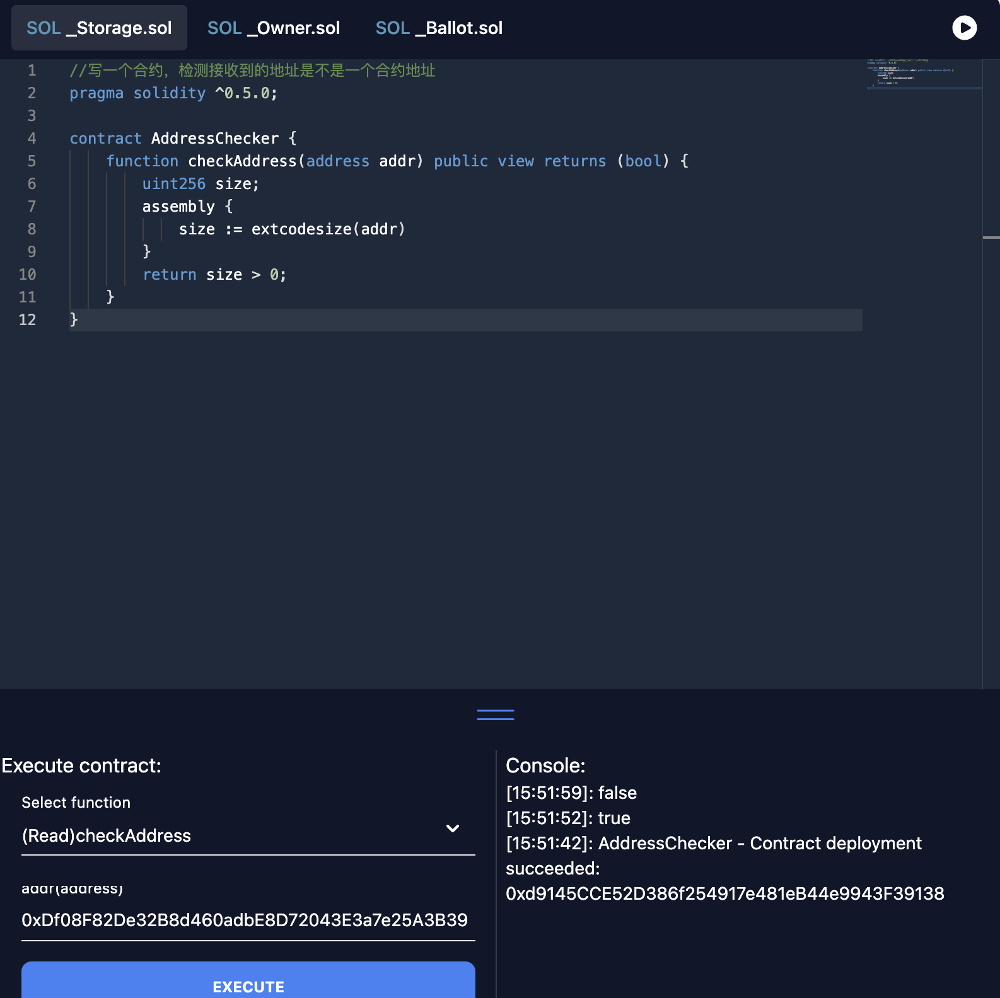

## SoliveAI

* SoliveAI is a plugin based on the Solive online playground, inspired by GitHub Copilot, that helps users write, check, and interpret Solidity contracts.

* SoliveAI是一个基于Solive online playground的插件，受github copilot启发，帮助用户编写、检查和解释Solidity合约。通过SoliveAI，用户可以在编写合约时获得更多的帮助，从而提高编写合约的效率。SoliveAI的功能包括：1. 代码补全，2. 代码检查，3. 代码解释，4. 代码生成。SoliveAI的目标用户是Solidity合约开发者，帮助他们提高编写合约的效率。

## 使用方法

* 将你需要生成的写在注释后面，例如：
    
    ```//写一个合约，检测接收到的地址是不是一个合约地址 ```
    
    然后按 **Command + k** (Windows下为Ctrl + k)，就会生成一个合约，检测接收到的地址是不是一个合约地址。
   
## demo地址
* [YouTube](https://www.youtube.com/watch?v=3qsWsoUJJiI)



## solive
* solive是wtf academy 成员编写，一个轻量化的solidity运行环境，详情： [solive](https://github.com/WTFAcademy/solive)


